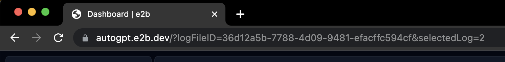
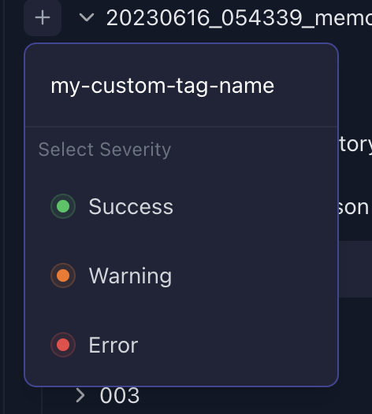

# 分享您的日志以帮助我们改进AutoGPT

您是否注意到您的代理有异常行为？您是否有有趣的用例？您是否有想要报告的bug？
请按照以下步骤启用并上传您的日志。在提交问题报告或与我们讨论问题时，您可以包含这些日志。

## 启用调试日志

活动、错误和调试日志位于`./logs`目录下。

要打印出调试日志：

```shell
./autogpt.sh --debug     # 在Linux / macOS上

.\autogpt.bat --debug    # 在Windows上

docker compose run --rm auto-gpt --debug    # 在Docker中
```

## 检查并分享日志

您可以通过[e2b](https://e2b.dev)检查和分享日志。


1. 访问[autogpt.e2b.dev](https://autogpt.e2b.dev)并登录。
2. 您将看到AutoGPT团队其他成员的日志，您可以进行检查。
3. 或者您可以上传自己的日志。点击“上传日志文件夹”按钮，选择您生成的调试日志目录。等待1-2秒，页面将重新加载。
4. 您可以通过分享浏览器中的URL来分享日志。


### 为日志添加标签

您可以为日志添加自定义标签，以便其他团队成员查看。如果您想表明代理在某些挑战中遇到问题，这将非常有用。

E2b提供三种严重程度：

- 成功
- 警告
- 错误

您可以随意命名您的标签。

#### 如何添加标签

1. 点击日志文件夹名称左侧的“加号”按钮。

    

1. 输入新标签的名称。

1. 选择严重程度。

    