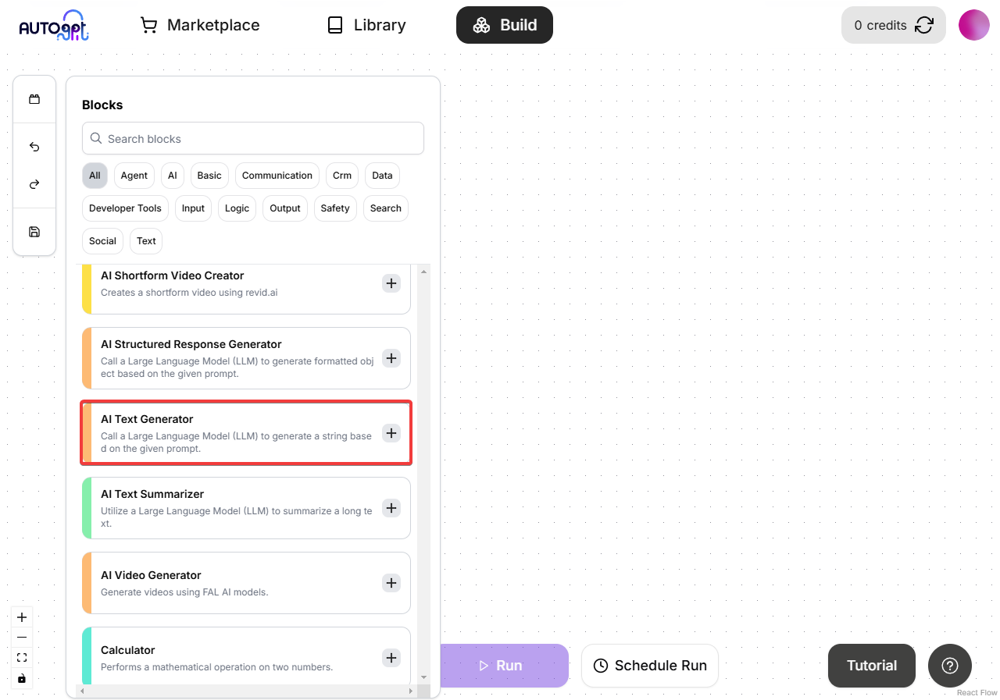
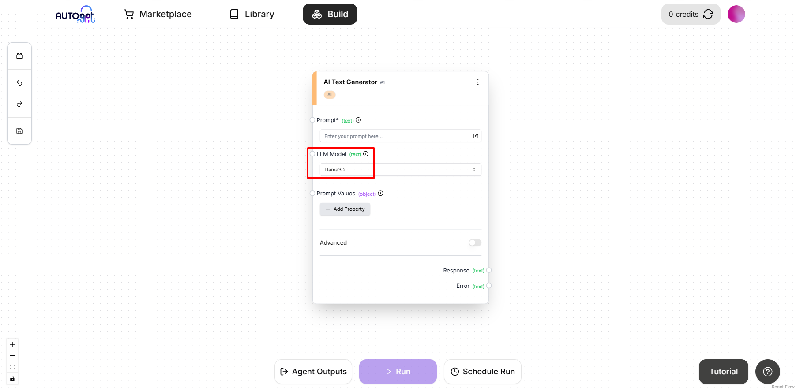
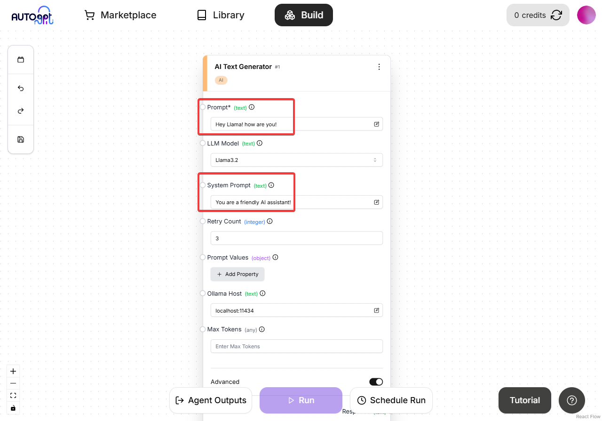
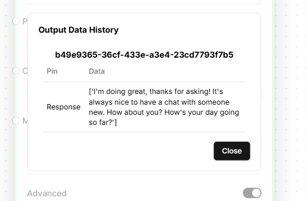
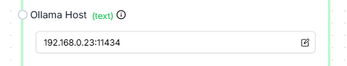

# 使用AutoGPT运行Ollama

> **重要提示**：Ollama集成仅在自托管AutoGPT平台时可用。无法在云托管版本中使用。

按照以下步骤设置并使用AutoGPT平台运行Ollama。

## 先决条件

1. 确保您已完成[AutoGPT设置](/platform/getting-started)步骤，如果未完成，请先完成再继续本指南。
2. 在开始之前，请确保您的机器上已安装[Ollama](https://ollama.com/download)。

## 设置步骤

### 1. 启动Ollama
打开一个新的终端并执行：
```bash
ollama run llama3.2
```

> **注意**：这将下载[llama3.2](https://ollama.com/library/llama3.2)模型并启动服务。请保持此终端在后台运行。

### 2. 启动后端
打开一个新的终端并导航到autogpt_platform目录：
```bash
cd autogpt_platform
docker compose up -d --build
```

### 3. 启动前端
打开一个新的终端并导航到前端目录：
```bash
cd autogpt_platform/frontend
npm run dev
```

然后访问[http://localhost:3000](http://localhost:3000)查看前端运行情况，注册账户/登录后，导航到构建页面[http://localhost:3000/build](http://localhost:3000/build)

### 4. 使用Ollama与AutoGPT

现在Ollama和AutoGPT平台都已运行，我们可以开始使用Ollama与AutoGPT：

1. 向工作区添加一个AI文本生成器块（它可以与任何AI LLM块一起使用，但在此示例中将使用AI文本生成器块）：
   

2. 在“LLM模型”下拉菜单中，选择“llama3.2”（这是我们之前下载的模型）
   

3. 现在我们需要添加一些提示，然后保存并运行图表：


就是这样！您已成功设置AutoGPT平台并向Ollama发出了LLM调用。



### 在远程服务器上使用Ollama与AutoGPT 
要在远程服务器上运行Ollama，只需确保Ollama服务器正在运行并且可以通过网络/远程访问端口11434，然后您可以使用上述相同的步骤，但您需要将Ollama服务器的IP地址添加到块设置中的“Ollama主机”字段，如下所示：



## 故障排除

如果遇到任何问题，请验证以下内容：

- Ollama已正确安装并运行
- 所有终端在操作期间保持打开状态
- 在启动后端之前Docker正在运行

常见错误：

1. **连接被拒绝**：确保Ollama正在运行且主机地址正确（还要确保端口正确，默认端口为11434）
2. **未找到模型**：尝试先手动运行`ollama pull llama3.2`
3. **Docker问题**：使用`docker ps`确保Docker守护程序正在运行